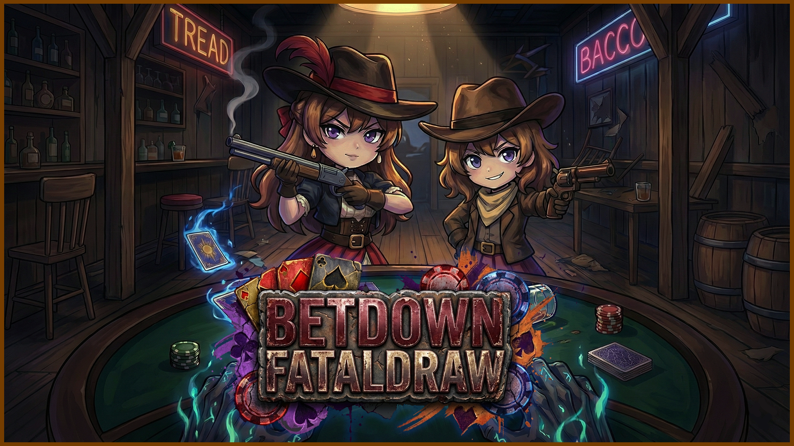

# Bawky

  

 

**Indie Game Dev** 
Passionate about creating unique gameplay experiences

 

 

## About Me

* **Education** : Pusan National Univ. Computer Science Engineering
* **Current Role** : Team Leader & Main Developer at **[Bawky Studio]** (2025~)
* **Content Creator** : Running a Game Dev Channel **[Bawky]** (3K+ Subscribers)
* **Expertise** : Game Dev Utilities, Multiplayer Networking, System Architecture

 

## Honors & Activities
**Proven Global Competence**

| Award / Activity | Description | Badge |
| :--- | :--- | :---: |
| **GDWC 2024** | **WINNER** in Best Hobby Game Category   *(Game Development World Championship)*    |  |
| **Krafton Jungle** | **Game Lab** Intensive Course Completion   *(Game Design Training Program)* |  |
| **KAIGA** | **Regular Member** (2026)   *(Korea Artificial Intelligence Game Association)* |  |

 

### In Progress Projects

| Project | Info | Preview |
| :--- | :--- | :--- |
| **FATALDRAW** (2025) Every Bullet is a Bet | **Type:** 2 Player Co-op Shooter **Role:** Project Lead **Team:** Bawky Studio **Status:** In Development   |  |

 

### Completed Projects

| Project | Info | Preview |
| :--- | :--- | :--- |
| **BIG BLIND** (2024) Where Sound Becomes Sight | **Type:** Game(2D Top down Shooter) **Role:** Main Developer **Team:** SPADE ACE **Achievement:** **GDWC 2024 WINNER**   |  |
| **Kalivra** (2026) Game Balance Adjustment Tool | **Type:** Software Tool **Role:** Developer **Status:** v1.0.1 Released   |  |

 

## Technical Overview

**Primary Languages** 

**Engines** 

**OS & Environment** 

**Infra & Tools** 

