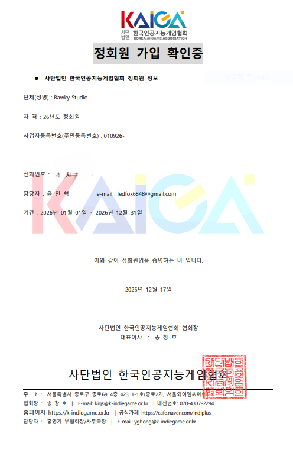
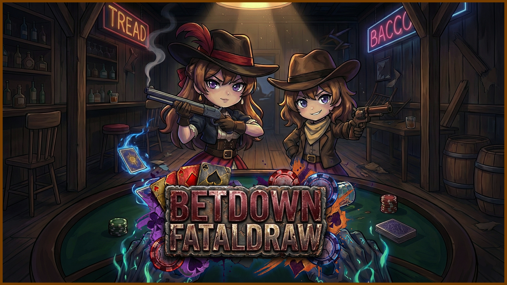
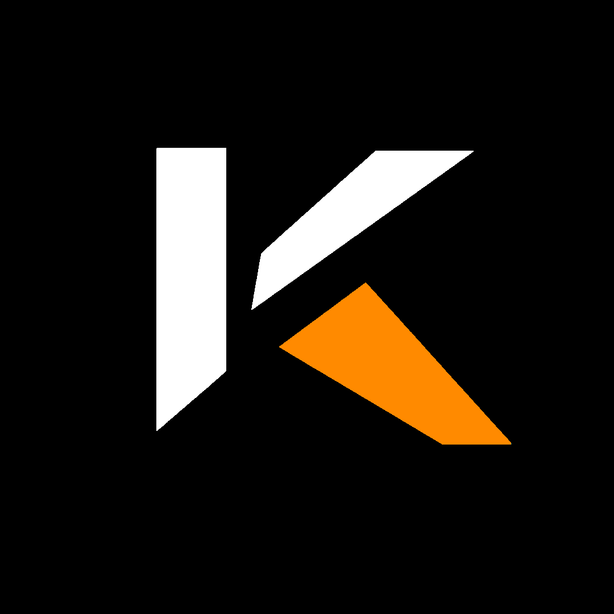
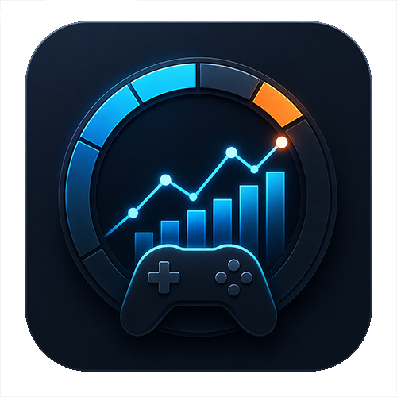
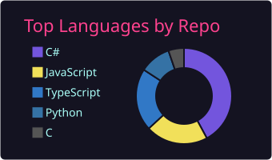
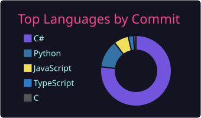

# BAWKY

### Indie Game Developer · Project Lead · Content Creator

 

---

## 👋 About

> I create games where a strong central idea turns into a memorable play experience.
> My work spans gameplay, multiplayer networking, developer tools, and system architecture.

- 🎓 **Computer Science & Engineering** — Pusan National University
- 🎮 **Team Leader & Main Developer** — [Bawky Studio](https://bawkystudio.com/en/main), 2025–Present
- 🎥 **Game Dev Creator** — [Bawky](https://www.youtube.com/@DevBawky), 3K+ subscribers
- 🧩 **Focused on** — Game-dev utilities, multiplayer networking, and system architecture

## 🏆 Highlights

|  | Highlight | What I did |
| :---: | :--- | :--- |
|  | **GDWC 2024 Winner** | Won the **Best Hobby Game** category at the [Game Development World Championship](https://thegdwc.com/championships/2024-winter/) |
|  | **Krafton Jungle · Game Lab** | Completed the intensive game-design training program |
|  | **KAIGA** | Regular member of the Korea Artificial Intelligence Game Association, 2026 |
|  | **Fast Campus** | Instructor for the Indie Game Development course |

## 🚧 Now Building

### FATALDRAW

*Every Bullet is a Bet.*

## 🕹️ Shipped Projects

| Project | Snapshot | Links |
| :--- | :--- | :---: |
|  **BIG BLIND** · 2024 Where Sound Becomes Sight | **2D top-down shooter** Main Developer · SPADE ACE 🏆 GDWC 2024 Best Hobby Game |  |
|  **ARSOL** · 2025 AR Spatial Overlay System | **AR web service** Server & Deployment PNU Capstone Project |  |
|  **Kalivra** · 2026 Game Balance Adjustment Tool | **Game-dev utility** Developer v1.0.1 released |  |
|  **Bawky Steam Analysis** · 2026 Steam Market Analysis Tool | **Data-analysis utility** Developer v1.0.1 released |  |

## 🧰 Tech Stack

**Languages**

**Engines & Frameworks**

**Platform & Workflow**

## 📊 GitHub at a Glance

 

Building strange, sharp, and genuinely fun things — one commit at a time.

